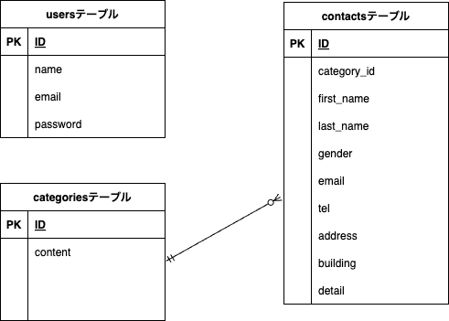

# お問い合わせフォーム

## 環境構築

### Dockerビルド
1. git clone git@github.com:saaya0401/contact-form.git
2. docker-compose up -d --build

&nbsp;&nbsp;&nbsp;&nbsp;&nbsp;※MySQLは、OSによって起動しない場合があるのでそれぞれのPCに合わせてdocker-compose.ymlファイルを編集してください。

### Laravel環境構築
1. docker-compose exec php bash
1. composer install
1. .env.exampleファイルから.envを作成し、環境変数を変更
1. php artisan key:generate
1. php artisan migrate
1. php artisan db:seed
1. composer require livewire/livewire

## 使用技術
- MySQL 8.0.26
- PHP 7.4.9-fpm
- Laravel 8

## URL
- 環境開発 : http://localhost/
- phpMyAdmin : http://localhost:8080/

## ER図
